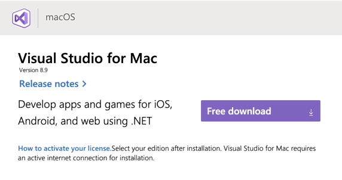
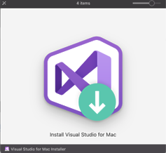
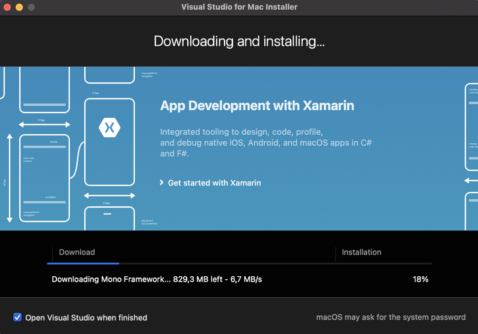
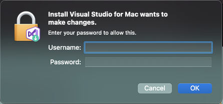
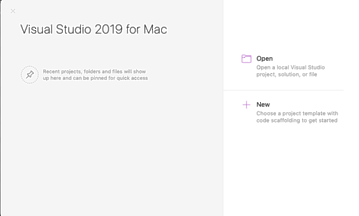
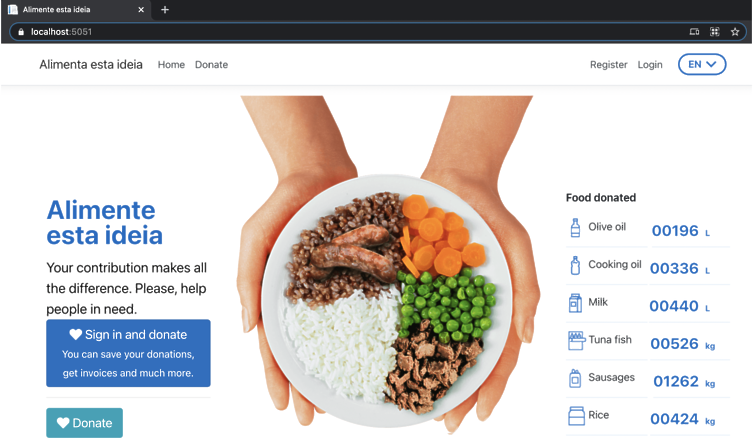

# Setting up a local development environment on a MacOS machine

## Table of contents:
- [Installation](#installation)
    - [Prerequisites](#prerequisites)
    - [Visual Studio](#visual-studio)
    - [.NET Core 3.1](#net-core)
- [Setup](#setup)
    - [Cloning the project](#cloning-the-project)
    - [Configuring secrets](#configuring-secrets)
    - [Whitelisting IP](#whitelisting-ip)
    - [Running project locally](#running-project-locally)

## Installation

### Prerequisites

- Git (<https://git-scm.com/download/mac>)
- Github account

### Visual Studio
1. Download Visual Studio from <https://visualstudio.microsoft.com/downloads>

    

2. Install Visual Studio

    
    
    

    

    

    

    
    

      After choosing `Open` you should see ASP.NET Core project types

    
    

### .NET Core

Alternatively, if you already have Visual Studio installed, but with no dotnet core, please proceed with the following instructions download and install it from <https://dotnet.microsoft.com/download>

## Setup
### Cloning the project

1. Provide your github username to code owners and ask them to add you to the organization and give you write permissions to the repo

2. Clone the project

    ```
    git clone git@github.com:banco-alimentar/alimentestaideia.pt.git
    ```

### Configuring secrets

1. If you received secrets via email, copy the part between curly braces `{...}` (including the braces) and paste it in a file

    ```
    pbpaste >~/secrets.json
    ```


3. Gmail might have removed some quotes around email addresses and urls, and now json file is not well formed - you will get an error if you try to import credentials

    You you need to restore quotes manually. Please edit `secrets.json` file and put quotes around values that don't have them, excluding only `true/false` values.

    For instance:

    - is: `"Smtp:User": alimentestaideia.dev@outlook.com,`
    - should be: `"Smtp:User": "alimentestaideia.dev@outlook.com",`

3. Import secrets into Web project

    ```
    cd BancoAlimentar.AlimentaEstaIdeia.Web
    cat ~/secrets.json | dotnet user-secrets set

    >Successfully saved 23 secrets to the secret store.

    rm ~/secrets.json   # remove secrets file
    ```

    Please be careful not to commit `secrets.json` file to the repo.

    If you get the following error, this means `secrets.json` is still not well formed and you should revisit point 3 (restore quotes that gmail removed)

    ```
    System.FormatException: Could not parse the JSON file.
    ```

### Whitelisting IP

Ask code owners to whitelist your public IP, so that you can connect with SQL database.

### Running from Visual Studio

1. Open Visual Studio, navigate to file `BancoAlimentar.AlimentaEstaIdeia.Web.sln`. Solution opens up.
2. In the solution tree view on the left you should see `BancoAlimentar.AlimentaEstaIdeia.Web` in bold. This name should also be visible in the top row to the right of "play" icon.
3. Press "play" icon and wait a bit
4. You can see the warning about developer certicicate missing. Choose `Always allow` unless you prefer to confirm it each time.
5. Window will pop-up with text `dotnet dev-certs wants to make changes` - click `Install and trust` and enter your credentials; alternatively you can run from terminal: `dotnet dev-certs https --trust`

      

6. You should see project website opens in a web browser

      

    Congratulations! You've made it! You can code now and test in your local environment.


### Addressing "Failed to bind to address error"

If you happen to encounter error: `Failed to bind to address https://127.0.0.1:5001: adress already in use`

Change it by editing settings file:

1. Open file `BancoAlimentar.AlimentaEstaIdeia.Web BancoAlimentar.AlimentaEstaIdeia.Web/Properties/launchSettings.json`
2. Modify key that contains the port number which didn't work for you - enter different port numbers

    ```
    "applicationUrl": "https://localhost:5001;http://localhost:5000",
    ```

To change it using Visual Studio options:

1. Right click `BancoAlimentar.AlimentaEstaIdeia.Web`, choose `Options`
2. On the left navigate to `Run -> Configurations -> Default`
3. On the right go to `ASP.NET Core` tab
4. Edit `App URL` and change the ports, for instance to `https://localhost:5051;http://localhost:5050`

      

5. Run project again

    Now you should see the website running on your local machine.

### Running from terminal

Alternatively you can run project from command line

```zsh
cd BancoAlimentar.AlimentaEstaIdeia.Web
dotnet run

# output below:
warn: Microsoft.AspNetCore.Identity.RoleManager[0]
      Role ******-18fc-4267-afc1-****** validation failed: DuplicateRoleName.
warn: Microsoft.AspNetCore.Identity.RoleManager[0]
      Role ******-58d1-43f7-b86b-****** validation failed: DuplicateRoleName.
warn: Microsoft.AspNetCore.Identity.UserManager[5]
      User is already in role Admin.
warn: Microsoft.AspNetCore.Identity.UserManager[5]
      User is already in role SuperAdmin.
warn: Microsoft.AspNetCore.Identity.UserManager[5]
      User is already in role Admin.
warn: Microsoft.AspNetCore.Identity.UserManager[5]
      User is already in role SuperAdmin.
info: Microsoft.Hosting.Lifetime[0]
      Now listening on: https://localhost:5051
info: Microsoft.Hosting.Lifetime[0]
      Now listening on: http://localhost:5050
info: Microsoft.Hosting.Lifetime[0]
      Application started. Press Ctrl+C to shut down.
info: Microsoft.Hosting.Lifetime[0]
      Hosting environment: Development
info: Microsoft.Hosting.Lifetime[0]
      Content root path: /Users/***/alimentestaideia.pt/BancoAlimentar.AlimentaEstaIdeia.Web
```

You can Command+click the address `https://localhost:5051` to open the website in your default web browser.
